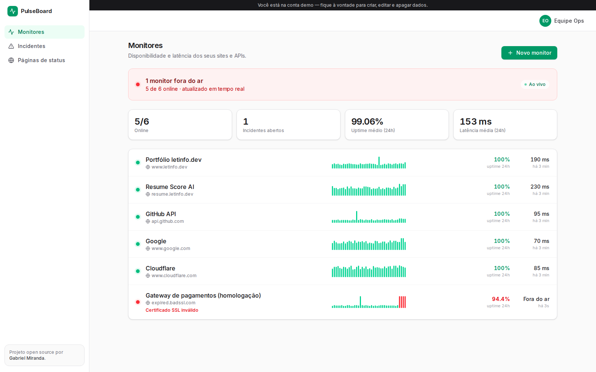
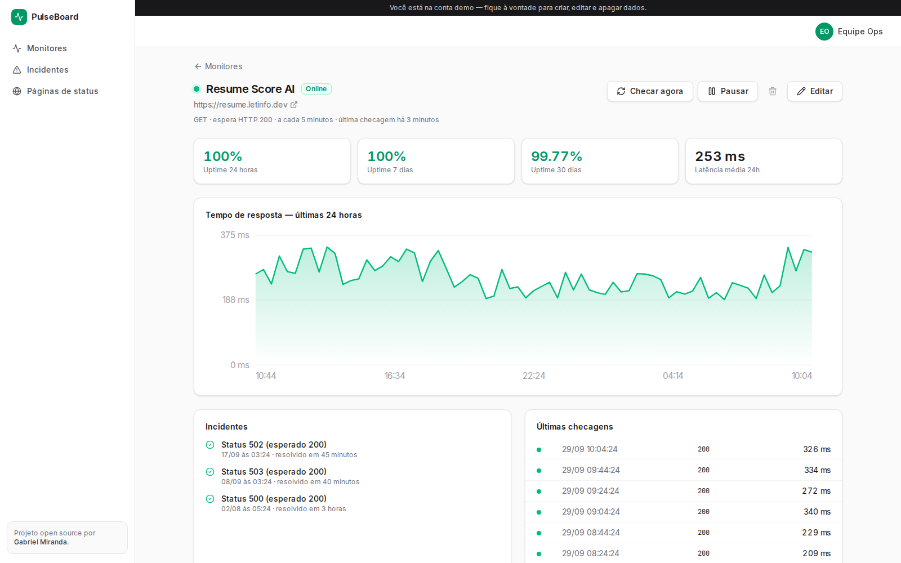

# Pulse Board


**Uptime monitoring with a live dashboard, automatic incidents and public status pages.**
Add a URL, choose how often to check it, and PulseBoard tracks availability and latency, opens
and closes incidents on its own, and gives your customers a status page with 90 days of history.



**Live demo:** [pulseboard.letinfo.dev/demo](https://pulseboard.letinfo.dev/demo) — signs in straight to a sample account.

> **Try it:** open the app and click **"Explorar com a conta demo"**. The demo monitors real public
> URLs (and one with an expired SSL certificate, so you can see an ongoing incident).
> (`demo@pulseboard.dev` / `demo1234`) · Public status page: `/status/demo`

## Features

| | |
| --- | --- |
| **Live dashboard** | Server-Sent Events push a new snapshot only when something changes — status, latency, sparkline and incidents update without reloading. |
| **Real HTTP checks** | Expected status code, keyword in the HTML, configurable timeout, GET/HEAD, human-readable errors (DNS, refused connection, invalid SSL, timeout). |
| **No false alarms** | One failure is a blip; **two consecutive failures** open an incident; the first healthy response closes it. |
| **Metrics** | Uptime for 24h / 7d / 30d, 24h latency chart, MTTR (mean time to recovery). |
| **Public status pages** | Daily uptime bars for 90 days (bucketed in the business timezone) and 30 days of incidents. |
| **Pause / check now** | Pausing closes open incidents; "check now" runs a check on demand. |



## Architecture

```
                 ┌──────── GitHub Actions (*/5) ───────┐
                 ▼                                      │
GET /api/cron/check  (Bearer CRON_SECRET) ──► runDueChecks()
GET /app/stream      (SSE, per user)      ──► runDueChecks(owner) + snapshot diff ──► browser
                                                  │
                            claim(monitor)  ← UPDATE … WHERE last_checked_at = <seen value>
                            performCheck()  ← fetch + timeout + SSRF guard
                            recordCheck()   ← one transaction: check + status + incident
```

- **No always-on worker needed.** Checks run from a protected cron endpoint (GitHub Actions calls
  it every 5 minutes for free — `.github/workflows/checks.yml`) *and* from the SSE stream while a
  dashboard is open, so an open dashboard is always fresh.
- **Optimistic locking** prevents double checks: a runner must win a conditional `UPDATE` on
  `last_checked_at` before checking a monitor, so the cron and several open dashboards never
  duplicate work.
- **State machine in one transaction**: inserting the check, changing the monitor status and
  opening/resolving the incident happen atomically.
- **SSRF protection**: URLs are resolved via DNS and rejected if they point to loopback or private
  ranges, so the monitor cannot be used to probe internal infrastructure.
- **Charts without a chart library**: the sparkline, latency chart and 90-day bars are plain SVG /
  CSS rendered on the server.

## Running locally

Requirements: Node.js 22+, Docker.

```bash
cp .env.example .env.local        # set AUTH_SECRET and CRON_SECRET
npm install
npm run setup                     # Postgres + migrations + 90-day demo history
npm run dev                       # http://localhost:3103
npm run worker                    # optional: local scheduler (calls the cron endpoint every 30s)
```

## Deploy

Vercel + any Postgres. Set `DATABASE_URL`, `AUTH_SECRET`, `CRON_SECRET`, `NEXT_PUBLIC_APP_URL`,
run `npm run db:deploy` and `npm run db:seed`. For scheduled checks, add the repository variable
`APP_URL` and the secret `CRON_SECRET` in GitHub so the `Scheduled checks` workflow can call the
endpoint.

## Stack

Next.js 16 · React 19 · TypeScript · Prisma 7 · PostgreSQL · Server-Sent Events · Auth.js v5 ·
Zod · Tailwind CSS 4

---

Built by [Gabriel Miranda](https://www.letinfo.dev) · MIT License
